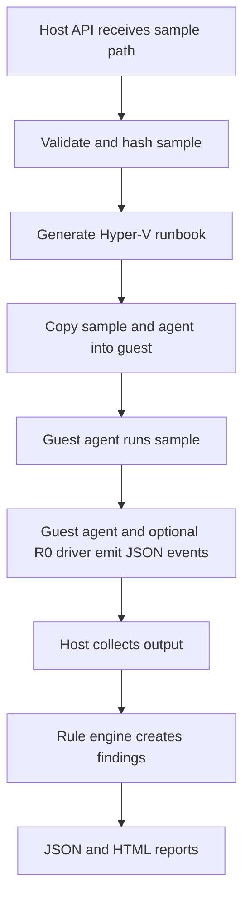

# Architecture

## Design goal

v1 is built around a controlled Windows 10 guest rather than agentless VMI. The
host prepares a clean VM, copies a sample and guest agent, runs the sample for a
bounded duration, collects normalized events, classifies behavior, and writes
local reports.

## Flow

## Components

- `KSword.Sandbox.Web`: ASP.NET host API and simple dashboard.
- `KSword.Sandbox.Core`: configuration, hashing, rule matching, runbook
  generation, job planning, and report rendering.
- `KSword.Sandbox.Abstractions`: shared records for config, jobs, events,
  runbooks, and reports.
- `KSword.Sandbox.Agent`: guest collector for process, file, network, and
  driver JSONL events.
- `rules/`: behavior rules and MITRE mapping seeds.

## Current execution mode

The host creates a dry-run plan by default. This is intentional: the local
machine currently needs administrator rights for Hyper-V enumeration and VM
mutation, and the project should review generated steps before any privileged
runner is added.

## Event schema

Every event uses the shared `SandboxEvent` shape:

- `eventType`: normalized event name such as `process.start` or `file.created`.
- `timestamp`: UTC event time.
- `source`: `host`, `guest`, or `driver`.
- `processName`, `processId`, `parentProcessId`: process context when known.
- `path`: primary file, registry, VM, or object path.
- `commandLine`: process command line when known.
- `data`: event-specific key-value details.
