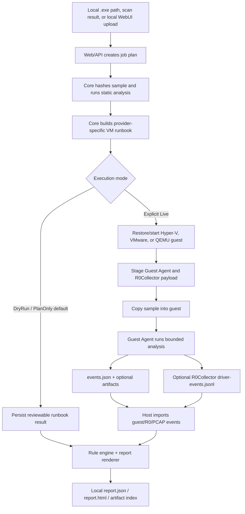

# 架构 / Architecture

KSwordSandbox 是本地 Windows 恶意行为分析沙箱骨架。当前 v1 链路围绕已准备的 Hyper-V、VMware 或 QEMU Windows 10 guest、host 侧规划与报告、guest 侧采集、可选 R0 遥测，以及仅保存在本机的证据文件构建。

English summary: KSwordSandbox is a local Windows malware-analysis sandbox scaffold with host planning/reporting, guest collection, optional R0 telemetry, and local-only artifacts.

需要同时覆盖 install/run、module ownership、driver test signing 和三种 provider live execution 的简明操作者地图，请参见 `docs/current-architecture-and-operations.md`。

English summary: see `docs/current-architecture-and-operations.md` for the concise operator map covering install/run, ownership, test signing, and live execution across all three providers.

## 设计目标 / Design goals

- Keep normal planning safe and reviewable: dry-run/PlanOnly must not mutate VM
  state or execute a sample.
- Make live execution explicit: VM mutation always requires an explicit live
  action; an elevated host process is required only by providers/steps that
  need it, plus a configured golden VM/baseline, guest credentials, staged
  guest payload, and a working guest
  transport.
- Normalize all telemetry as `SandboxEvent` so host, guest, driver, PCAP,
  enrichment, and static-analysis signals can share the same rule/report path.
- Keep samples, VM disks, reports, payloads, build output, signed drivers,
  certificates, and secrets outside git.
- Keep optional external enrichment hash-only by default; VirusTotal lookups do
  not upload samples.

## 高层流程 / High-level flow

## 运行边界 / Runtime boundaries

Host（主机）:

- owns WebUI/API, job planning, runbook generation, runbook execution records,
  local upload storage, artifact import, rule classification, and reports;
- needs Administrator rights for live Hyper-V operations; VMware/QEMU steps do
  not require elevation unconditionally, although local networking may;
- writes runtime data under `paths.runtimeRoot`, normally
  `D:\Temp\KSwordSandbox`.

Guest（来宾 VM）:

- runs the submitted sample inside the prepared VM;
- writes `events.json`, marker files, and optional artifacts under the
  configured guest output folder;
- can run R0Collector as a sidecar, either in mock mode or against a real driver
  device.

Driver/R0（内核遥测）:

- is optional for the default safe chain;
- is source-only in the repository;
- requires Windows test mode and a local test certificate for real `.sys`
  loading in an isolated VM;
- must not use `CSignTool.exe` or commit signed binaries/certificates.

External services（外部服务）:

- are optional;
- currently limited to VirusTotal hash reputation lookup;
- do not receive sample bytes by default.

Git（仓库边界）:

- stores source, docs, rules, configuration templates, and smoke contracts;
- must not store runtime outputs, build artifacts, large files, VM disks,
  samples, credentials, certificates, or signed driver files.

## 模块边界 / Module boundaries

- `KSword.Sandbox.Abstractions`: shared immutable models and contracts.
- `KSword.Sandbox.Core`: configuration loading, hashing, static analysis,
  runbook building, runbook-result persistence, guest/R0 event import, rule
  classification, artifact indexing, and report rendering.
- `KSword.Sandbox.Web`: dashboard/API endpoints, local upload/scan, job
  planning, background runbook start, live-event/progress endpoints, guarded
  artifact downloads, and optional VirusTotal settings.
- `KSword.Sandbox.Agent`: guest collector and sample launcher.
- `KSword.Sandbox.R0Collector`: guest user-mode JSONL bridge for mock or driver
  telemetry.
- `KSword.Sandbox.Driver`: WDK driver source for real R0 telemetry.
- `rules/`: behavior, static, and MITRE mapping data.
- `scripts/`, `install.ps1`, `run.ps1`: local operator automation, readiness,
  payload staging, and policy checks.
- `tests/KSword.Sandbox.SmokeTests`: contract/smoke checks.

Preferred dependency direction is `Web -> Core -> Abstractions`. Guest and
driver components emit files/events that Core imports; they should not depend
on WebUI implementation details.

## 执行模式 / Execution modes

Plan/DryRun:

- validates the sample path and size;
- computes hashes and static analysis;
- builds a deterministic provider-specific VM runbook;
- writes reports and/or `runbook-execution.json`;
- does not start, restore, stop, or mutate any VM.

Live:

- requires explicit `-Live` or a live WebUI/API start action;
- runs from an elevated host process when the selected provider/step requires it;
- restores or creates the analysis VM, stages payloads, copies the sample, runs
  Guest Agent/R0Collector, syncs outputs, stops the VM, and restores cleanup
  state;
- writes `runbook-execution.json`, guest outputs, imported events, reports, and
  artifact indexes under the runtime root.

## 事件 Schema / Event schema

Every telemetry row uses the shared `SandboxEvent` shape:

- `eventType`: normalized name such as `process.start`, `driver.file`,
  `network.tcp`, `pcap.http`, or `static.analysis.completed`;
- `timestamp`: UTC event time;
- `source`: `host`, `guest`, `driver`, `r0collector`, `pcap`, or another
  normalized source;
- `processName`, `processId`, `parentProcessId`: process context when known;
- `path`: primary file, registry, network, VM, report, or object path;
- `commandLine`: process command line when known;
- `data`: event-specific string key/value evidence.

The report renderer separates sample behavior from collection health,
R0Collector self-noise, VirusTotal status, and static-only triage so operational
diagnostics do not inflate the verdict.
