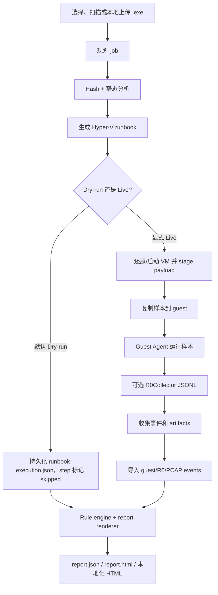

# 当前架构与运维指南（architecture and operations）

本文是贡献者和操作者的中文总览：连接当前模块边界、最小可用链路、驱动测试签名策略，以及
Hyper-V 安装/运行流程。更细的操作步骤保留在链接的 runbook 中。

本文是当前 MVP 状态和操作者链路（operator chain）的权威文档；文档库存、主次关系和历史/背景文档说明见
`docs/README.md`。

## 当前 MVP 状态（current MVP status）

当前最小可用链路已经围绕本地 WebUI/API 和准备好的 Windows 10 Hyper-V golden VM 成形：

1. 操作者在 WebUI/API 中选择或本地上传 `.exe`，文件保存在仓库外 runtime root。
2. Host 生成 job、SHA-256/静态分析事件（含 `static.pe.resource`）、
   PlanOnly/DryRun 或 Live Hyper-V 运行手册（runbook）。
3. 默认 PlanOnly/DryRun 只记录意图；显式 Live 才会还原/启动配置的 VM、stage Guest Agent/R0Collector
   payload、复制样本并运行 Guest Agent。
4. Guest Agent 采集 guest 行为，R0Collector 可在 mock 或 real R0 模式输出 `driver-events.jsonl`；
   新版 Collector 还会在可用时写出 `r0collector.driverNetworkStatus`，把 WFP/ALE layer mask、
   计数器（counters）、降级原因（degrade reason）和就绪状态（readiness state）作为采集质量证据。
5. WebUI 优先通过 `/api/jobs/{jobId}/progress/stream` SSE 展示真实 runbook step；代理、
   浏览器或无快照时回退 durable `runbook-progress.json` / `/runbook/progress` polling，并通过
   live raw-event endpoint 展示事件。
6. 可选 VirusTotal（VT）只做 SHA-256 hash lookup，不上传样本；缺 key 或查询失败保持低噪音。
7. Host 导入 `events.json`、`driver-events.jsonl`、PCAP/artifact manifest 等 evidence，重跑规则并生成
   `report.json`、`report.html`、`report.zh.html`、`report.en.html` 和 artifact index。Web artifact
   API 只接受 index 中的安全相对 selector，并暴露 download href、duplicate 和 rejection diagnostics。

已记录的本地实时证据（live evidence）见 `docs/webui-real-r0-e2e.md`。这是历史证据，不是本轮新验证（fresh
validation）；发布说明（release notes）若要声明“本候选已生成真实 Notepad 5s/live 报告”，必须由
发布负责人（release manager）在准备好的 lab host 重新运行并记录 job id。该证据不改变仓库策略：样本、
VM 文件、payload、job 目录、reports、PCAP、dump、build output、签名 driver、证书和
secrets 都不得提交。

## 运行原则（operating principles）

- KSwordSandbox 是本地优先（local-first）的公益恶意样本分析沙箱，用于已授权的防御研究和教育。
- 计划（plan）默认安全。普通 plan 或 dry-run 只记录意图，不还原、不启动、不停止、不修改 VM。
- 样本默认留在本机。浏览器 upload 只把可执行文件存到本地 runtime root；可选 VirusTotal（VT）
  enrichment 是 hash-only，不上传样本字节。
- 运行期产物（runtime artifacts）不进 git：samples、reports、job folders、payloads、VM disks、
  build outputs、signed drivers、symbols、certificates、secrets 都必须留在仓库外。
- `CSignTool.exe` 和旧 KSword signing wrapper 不属于默认工作流。真实驱动验证只在隔离 VM 中使用
  Windows test mode 和本地测试证书。
- 文档/中文化任务只改文档，不构建、不签名、不提交构建产物、不 push。

## 模块边界（module boundaries）

- `src/KSword.Sandbox.Abstractions/`：共享 record 和 contract，覆盖 config、submission、sample
  identity、runbook、telemetry、artifact、report、Hyper-V profile 和规则事件。这里不拥有
  host/guest 副作用。
- `src/KSword.Sandbox.Core/`：宿主侧业务逻辑。负责加载 config/rules、hash 与静态分析样本（含
  `static.pe.resource` 等结构化事件）、构建
  Hyper-V runbook、通过 executor boundary 执行或记录 runbook、导入 guest/R0 事件、分类行为、
  索引 artifacts、渲染 reports。
- `src/KSword.Sandbox.Web/`：ASP.NET WebUI/API。负责 dashboard、本地可执行文件上传/扫描（executable upload/scan）、job
  planning、后台 runbook 启动、progress SSE/polling、live-event endpoints、artifact index/download
  卡片、受保护 artifact download，以及可选 VirusTotal hash lookup settings。Settings 中的 VT key
  只写当前进程环境，不写磁盘。
- `guest/KSword.Sandbox.Agent/`：VM 内采集器。按限定时间运行样本，输出 `events.json`，并可收集
  dropped files、screenshots、memory dumps、packet captures 和 R0Collector JSONL。
- `guest/KSword.Sandbox.R0Collector/`：guest 内用户态桥。连接 driver device 或 mock mode，并写出
  与 `SandboxEvent` 兼容的 JSON Lines；可用时额外输出 `r0collector.driverNetworkStatus`，不可用时
  以 degraded 诊断行降级，不中断采集。
- `driver/KSword.Sandbox.Driver/`：WDK kernel driver 源码。git 中只保留 source，提供 control-device、
  ring-buffer、health/capability/status 和 producer telemetry path。生成的 `.sys` 与 symbols 只是本地
  lab artifacts。
- `rules/`：Core 使用的 behavior rules、MITRE mapping 和 static-analysis notes。除非明确需要改 engine，
  规则变更应尽量保持 data-oriented。
- `scripts/`、`install.ps1`、`run.ps1`：操作者入口、readiness checks、payload staging、Hyper-V E2E、
  native build helper、repository policy、本地 install/run 状态管理。
- `tests/KSword.Sandbox.SmokeTests/`：repository shape、policy、runbook、report、rules、WebUI contracts
  和 R0/collector expectations 的 contract/smoke checks。
- `docs/`：operator 和 contributor runbook。文档更新应链接到实现 owner，避免在多个文档重复长命令。

依赖方向保持：`Web -> Core -> Abstractions`；guest/driver 只产出事件，由 Core 消费；scripts 编排
host/VM 环境。driver 和 guest 项目不依赖 WebUI 代码。

## 当前执行链路（execution chain）



关键边界：

- Planning 和 dry-run 不修改 VM。
- Live 模式需要提权的 host process、已准备的 golden VM/checkpoint、guest credentials，以及已暂存的
  guest payload files。
- 可选真实 R0 需要本地 build 且 test-signed 的 `.sys`；mock R0 可在不加载 kernel driver 的情况下验证
  Guest Agent/R0Collector JSONL 通路。
- Reports 和 artifacts 写到 runtime root，不写到仓库。

## 最小可用链路（minimum use chain）

已有 golden VM 的一次性本地安装：

```powershell
.\install.ps1 -InstallEntrypoint CreateOrPreparePath -PromptPassword
```

日常 WebUI 启动：

```powershell
.\run.ps1
```

内置样本的安全计划：

```powershell
.\run.ps1 -Mode Analyze -SamplePreset Notepad
.\run.ps1 -Mode Analyze -SamplePreset HarmlessSample
```

这些 `Analyze` 命令在没有 `-Live` 时是 PlanOnly，不启动、不还原、不停止、不修改 VM。

从提权 shell（elevated shell）运行 live Hyper-V 分析：

```powershell
.\scripts\Test-HyperVReadiness.ps1
.\run.ps1 -Mode Analyze -SamplePreset HarmlessSample -Live
```

如果提权进程（elevated process）看不到 `KSWORDBOX_GUEST_PASSWORD`，通过以下方式设置：

```powershell
.\install.ps1 -InstallEntrypoint CreateOrPreparePath -PromptPassword
.\install.ps1 -Mode Change -ResetPassword -PromptPassword
.\scripts\Test-HyperVReadiness.ps1 -PromptForMissingGuestPassword
```

不要把密码写入仓库文件、报告或命令记录。

API/WebUI E2E dry-run 验证（不修改 VM）：

```powershell
.\scripts\Invoke-WebUIApiE2E.ps1 -BaseUrl 'http://127.0.0.1:18082'
```

Live API/WebUI E2E 会修改配置的 VM；必须先通过就绪检查（readiness），并只在 lab host 上显式运行：

```powershell
.\scripts\Invoke-WebUIApiE2E.ps1 -BaseUrl 'http://127.0.0.1:18082' -Live
```

## 驱动测试签名边界（driver test-signing boundary）

默认验证是 compile-only：

```powershell
.\scripts\Invoke-NativeBuild.ps1 -Project .\KSwordSandbox.sln -Configuration Debug -Platform x64
```

普通构建、冒烟测试和文档任务中不要签名、安装、启动或打开 driver；不要调用 `CSignTool.exe`。

可选真实驱动验证（driver validation）仅限 VM：

1. 本地构建 driver 和 R0Collector。
2. 生成的 `.sys`、`.pdb`、`.exe` 和 certificates 保持在 git 外。
3. 在可丢弃 VM 内启用 Windows test-signing 并重启。
4. 使用本地测试证书签名，或在隔离 lab 路径使用 `scripts/Sign-SandboxDriverWithTestCertificate.ps1`。
5. 通过本地 config 记录 host-side `.sys`：

   ```powershell
   .\install.ps1 -Mode Change -UpdateHyperVConfig -DriverHostPath <test-signed .sys>
   ```

6. 查询或开启 guest test-signing：

   ```powershell
   .\install.ps1 -Mode Change -QueryGuestTestSigning
   .\install.ps1 -Mode Change -EnableGuestTestSigning -RestartGuestAfterTestSigning -Force
   ```

7. 在任何 service install/start 前运行 `scripts\Test-R0Readiness.ps1`。
8. 验证后恢复 VM checkpoint。

只想验证 host/guest/R0Collector JSONL 通路时，在 local config 中使用 `driver.useMockCollector=true`。
完整 readiness 和 service mutation 顺序见 `docs/driver-signing.md`。

## Hyper-V 安装运行流程（install-run workflow）

1. 准备或导入 Windows 10 x64 golden VM。
2. 创建 clean checkpoint，通常命名为 `Clean`。
3. 启用 Guest Service Interface，并用配置的本地 guest account 验证 PowerShell Direct。
4. 运行 `./install.ps1 -InstallEntrypoint CreateOrPreparePath -PromptPassword`，把 local config 和 guest credential state 存在仓库外。
5. 需要时更新 VM/checkpoint/path：

   ```powershell
   .\install.ps1 -Mode Change -UpdateHyperVConfig `
     -VmName 'KSwordSandbox-Win10-Golden' `
     -CheckpointName 'Clean' `
     -GuestWorkingDirectory 'C:\KSwordSandbox'
   ```

6. WebUI 启动时可让 `./run.ps1` 尽力（best-effort）准备 guest payload；live run 前也可显式运行：

   ```powershell
   .\scripts\Prepare-GuestPayload.ps1 -SelfContained
   ```

7. 在 elevated shell 中运行只读 readiness：

   ```powershell
   .\scripts\Test-HyperVReadiness.ps1
   ```

8. 先审阅（review）PlanOnly/WhatIf：

   ```powershell
   .\run.ps1 -Mode Analyze -SamplePreset HarmlessSample
   .\scripts\Invoke-HyperVE2E.ps1 `
     -SamplePath 'D:\Temp\KSwordSandbox\samples\KSword.Sandbox.HarmlessSample\KSword.Sandbox.HarmlessSample.exe' `
     -Live `
     -WhatIf
   ```

9. 确认就绪检查（readiness）通过后再 live：

   ```powershell
   .\run.ps1 -Mode Analyze -SamplePreset HarmlessSample -Live
   ```

10. 检查 `D:\Temp\KSwordSandbox\jobs\<job-id>\report.html`、`runbook-execution.json`、
    `events.json` 和可选 `driver-events.jsonl`。不要提交或推送这些 runtime outputs。

详细文档：

- `docs/install.md`：installer、credentials、local config、status。
- `docs/run.md`：日常 WebUI、PlanOnly、Analyze、live run、report rebuild、artifact inspection。
- `docs/hyperv-e2e-runbook.md`：脚本式 Hyper-V PlanOnly/WhatIf/Live 流程。
- `docs/golden-vm.md`：golden VM 准备与 checkpoint 期望。
- `docs/guest-payload-staging.md`：Guest Agent/R0Collector payload staging。
- `docs/webui-real-r0-e2e.md`：已记录的本地 real-R0 WebUI/API 验证证据。

## 部署产品化检查点（deployment checklist）

- 明确运行模式：PlanOnly 演示、Live Hyper-V lab、真实 R0 lab 分开配置和授权。
- WebUI/API 默认建议只在本机或受控内网使用；团队化部署前补访问控制、审计、下载权限和防火墙策略。
- Runtime root 要放在仓库外，并规划容量、保留期、清理和导出策略。
- 样本、报告、payload、VM disk、driver build output、test certificates、DPAPI backups 和 keys 不入库。
- Golden VM 更新要有 owner；更新 baseline 后重新创建 `Clean` checkpoint 并记录验证日期。
- VirusTotal（VT）只是信誉富化（reputation enrichment）；缺 key、rate limit、not found 不应制造噪音行为告警。

## 仓库卫生检查（repository hygiene）

交接文档或运维改动前：

```powershell
git status --short
git diff --check -- README.md docs
.\scripts\Test-RepositoryPolicy.ps1
```

文档任务不要构建（build）、不要签名（sign）、不要暂存生成文件（stage generated files）、不要提交 runtime artifacts、不要 push。
如果同一 checkout 有其他 worker 的代码改动，不要 revert；只报告自己编辑过的文件。
